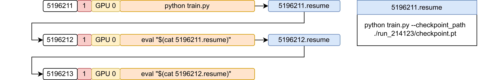

# AutoSlurm


`AutoSlurm` automatically generates slurm job scripts based on reusable templates and starts them for you.
This includes support for multi-task multi-GPU jobs, automatic creation of infinite chain jobs, and support for hyperparameter sweeps.
A large number of ready-to-use templates for all major HPC clusters at KIT and beyond exist, such that you can immediately start
throwing compute at your problems without writing boring job scripts yourself.

## Setup

To get started, simply install the repository as a pip package:

```
pip install git+https://github.com/aimat-lab/AutoSlurm.git
```

The command `aslurm` will then be available to start jobs.

## Job templates

`AutoSlurm` works by filling predefined bash script templates. All templates can
be found in `./auto_slurm/configs/`. The default templates are summarized in the
table below. Templates for other node types and new HPC clusters can easily be
added by simply adapting one of the existing templates.

| Cluster  	| Config name          	| Slurm partition   	| GPUs                   	| Threads (with hyperthreading) 	| Memory     	| Time limit 	|
|----------	|----------------------	|-------------------	|------------------------	|-------------------------------	|------------	|------------	|
| HAICORE  	| haicore_4gpu         	| normal (advanced) 	| 4 x A100 (40GB)        	| 152                           	| 501600 MB  	| 72h        	|
| HAICORE  	| haicore_1gpu         	| normal (advanced) 	| 1 x A100 (40GB)        	| 38                            	| 125400 MB  	| 72h        	|
| HAICORE  	| haicore_halfgpu      	| normal (advanced) 	| 0.5 x A100 (40GB)      	| 19                            	| 62700 MB   	| 72h        	|
| HoreKa   	| horeka_4gpu          	| accelerated       	| 4 x A100 (40GB)        	| 152                           	| 501600 MB  	| 48h        	|
| HoreKa   	| horeka_1gpu          	| accelerated       	| 1 x A100 (40GB)        	| 38                            	| 125400 MB  	| 48h        	|
| HoreKa   	| horeka_4gpu_h100     	| accelerated-h100  	| 4 x H100 (80GB)        	| 128                           	| 772000 MB  	| 48h        	|
| HoreKa   	| horeka_1gpu_h100     	| accelerated-h100  	| 1 x H100 (80GB)        	| 32                            	| 193000 MB  	| 48h        	|
| JUWELS   	| juwels_4gpu          	| booster           	| 4 x A100 (40GB)        	| 48 (Hyperthreading disabled)  	| 515000 MB  	| 24h        	|
| bwUni    	| bwuni_4gpu_gpu4      	| gpu_4             	| 4 x V100 (32GB)        	| 80                            	| 376000 MB  	| 48h        	|
| bwUni    	| bwuni_1gpu_gpu4      	| gpu_4             	| 1 x V100 (32GB)        	| 20                            	| 94000 MB   	| 48h        	|
| bwUni    	| bwuni_8gpu_gpu8      	| gpu_8             	| 8 x V100 (32GB)        	| 80                            	| 752000 MB  	| 48h        	|
| bwUni    	| bwuni_1gpu_gpu8      	| gpu_8             	| 1 x V100 (32GB)        	| 10                            	| 94000 MB   	| 48h        	|
| bwUni    	| bwuni_4gpu_gpu4_a100 	| gpu_4_a100        	| 4 x A100 (40GB)        	| 128                           	| 510000 MB  	| 48h        	|
| bwUni    	| bwuni_1gpu_gpu4_a100 	| gpu_4_a100        	| 1 x A100 (40GB)        	| 32                            	| 127500 MB  	| 48h        	|
| bwUni    	| bwuni_4gpu_gpu4_h100 	| gpu_4_h100        	| 4 x H100 (80GB)        	| 128                           	| 510000 MB  	| 48h        	|
| bwUni    	| bwuni_1gpu_gpu4_h100 	| gpu_4_h100        	| 1 x H100 (80GB)        	| 32                            	| 127500 MB  	| 48h        	|
| int-nano 	| intnano_2gpu         	| gpu               	| 2 x RTX 2080 TI (11GB) 	| 32 (Hyperthreading disabled)  	| 128000 MB  	| unlimited  	|
| int-nano 	| intnano_1gpu         	| gpu               	| 1 x RTX 2080 TI (11GB) 	| 16 (Hyperthreading disabled)  	| 64000 MB   	| unlimited  	|
| int-nano 	| intnano_3gpu_a100    	| aimat             	| 3 x A100 (80GB)        	| 384                           	| 1490000 MB 	| unlimited  	|
| int-nano 	| intnano_1gpu_a100    	| aimat             	| 1 x A100 (80GB)        	| 128                           	| 496666 MB  	| unlimited  	|

As one can see in this table, if less than all available GPUs of a node are
used, the other ressources (CPUs and memory) are scaled down proportionally by
default.

## Single-task jobs


<br><br>

You can execute a single task (script) in the following way:

```
aslurm -cn horeka_1gpu cmd python train.py
```

This will execute `python train.py` using a single GPU on `HAICORE`.

Every template by default first loads a default conda environment. The default conda environment can be specified in `global_config.yaml`.

<span style="color: red;">️🚀 Tip: When running `aslurm`, the slurm job files will be written to `./aslurm/` and then executed. If you only want to create the job files without executing them (for example, for testing), you can run `aslurm` with the `--dry` flag.</span>


### Overwrites


### Automatic `hostname → config` mapping

## Multi-task jobs


<br><br>

If you simply want to run the exact same command multiple times, you can also use the cmd`i`x shorthand notation:

...

cmd`i`x will simply repeat the following command `i` times.
This can be helpful when generating the final results of a research paper, where the experiments need to be repeated multiple times to test reproducibility.

TODO: gpus_per_task
TODO: max_tasks, NO_gpus

For example, if you want to run two tasks, each using two GPUs, with the `horeka_4gpu` configuration, you can run the following:

```
TODO
```

By default, `tasks_per_job` is set to null and is therefore calculated using `NO_gpus` and `gpus_per_task`.

If you want to run non-GPU jobs, or if you want to take care of the GPU assignment yourself, set `NO_gpus` and `gpus_per_task` to null.
Then, you can simply specify `tasks_per_job` directly.

### Automatic splitting

If when calling `aslurm` you specify more commands than `max_tasks` of the chosen configuration,
the commands will be automatically split accross multiple jobs / nodes. This is especially useful
when using the sweep shorthand notation (see below for an example).

### Sweeps

Instead of specifying the commands for all tasks in a parallel job (flag `-p`) explicitly, we offer an easy shorthand syntax 
to specify a sweep of tasks. This can be helpful when performing hyperparameter sweeps.

There are two ways to specify sweeps:

1. <[...]> notation to simply list the parameters of the sweep.
    - Example:
        ```bash
        aslurm horeka_4gpu cmd python train.py lr=<[1e-3,1e-4,1e-5,1e-6]> batch_size=<[1024,512,256,128]>
        ```
        - This will run the following 4 tasks in parallel on a single HoreKa node:
            - python train.py lr=1e-3 batch_size=1024
            - python train.py lr=1e-4 batch_size=512
            - python train.py lr=1e-5 batch_size=256
            - python train.py lr=1e-6 batch_size=128

2. <{ ... }> notation to define product spaces (grid search) of sweep parameters.
    - Example:
        ```bash
        aslurm horeka_4gpu cmd python train.py lr=<{1e-3,1e-4,1e-5,1e-6}> batch_size=<{1024,512,256,128}>
        ```
        - This will create tasks using the product space of the two specified lists, yielding all possible combinations (16).
        - Since the `horeka_4gpu` configuration allows a maximum of 4 tasks, the 16 tasks will be automatically split accross 4 jobs / nodes.

The second example is illustrated here:


<br><br>

## Chain jobs


<br><br>

This of course also works with multi-task jobs:


<br><br>

Note that this will keep spawning new chain jobs as long as at least one of the tasks writes a resume file.
If no task writes a resume file, the chain ends.