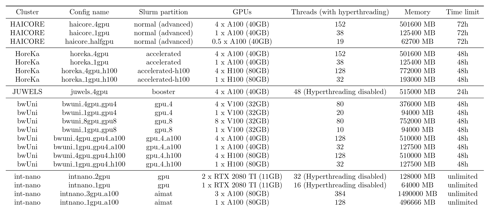
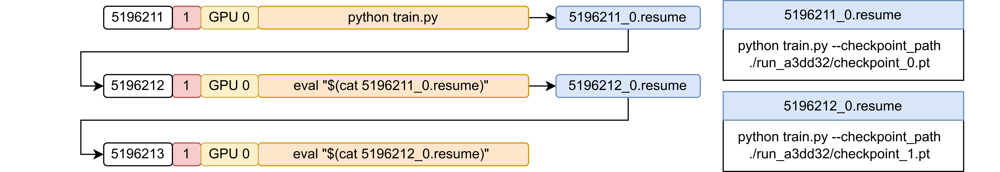
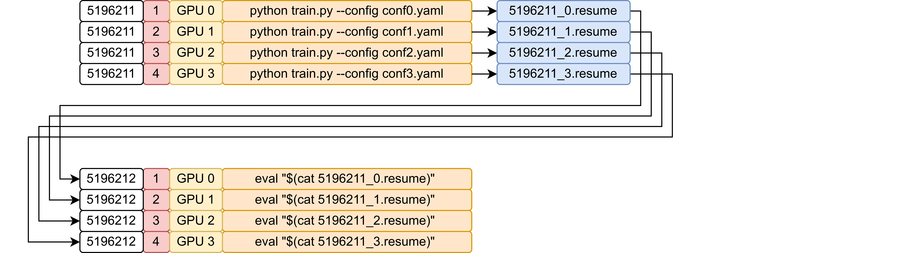

# AutoSlurm


`AutoSlurm` automatically generates slurm job scripts based on reusable
templates and starts them for you. This includes support for multi-task
multi-GPU jobs, automatic creation of infinite chain jobs, and hyperparameter
sweeps. A large number of ready-to-use templates for all major HPC clusters at
KIT and beyond exist, such that you can immediately start throwing compute at
your problems without writing boring job scripts yourself.

🚀 **Note:** If things do not work as expected, if you have questions, or if you
have ideas for new features, please let me (Henrik) know.

## Setup

To get started, simply install the repository as a pip package:

```bash
pip install git+https://github.com/aimat-lab/AutoSlurm.git
```

The command `aslurm` will then be available to start jobs.

## Job templates

`AutoSlurm` works by filling predefined bash script templates. All templates can
be found in the form of template config files in `./auto_slurm/configs/`. The
default templates are summarized in the table below. 


<br><br>

As one can see in this table, if less than all available GPUs of a node are
used, the other ressources (CPUs and memory) are scaled down proportionally by
default. This behavior can be changed using overwrites (see below).

🚀 **Note:** Templates for other node types and new HPC clusters can easily be
added by simply adapting one of the existing templates. Feel free to directly
push new job templates to this repository, such that other people can use them,
too. Please also notify me after adding new templates, such that I can update
the table.

## Single-task jobs


<br><br>

You can execute a single task (script) in the following way:

```bash
aslurm -cn haicore_1gpu cmd python train.py
```

This will execute `python train.py` using a single GPU on `HAICORE`.

🚀 **Tip:** When running `aslurm`, the slurm job files will be written to `./.aslurm/` and then executed with `sbatch`. If you only want to create the job files without executing them (for example, for testing), you can run `aslurm` with the `--dry` flag.

### Overwrites

Every slurm job first activates a default `conda` environment. The default
environment can be specified in `~/.config/auto_slurm/general_config.yaml`.
A default version of this config file will be written after running `aslurm`
for the first time, e.g. `aslurm --help`.

Furthermore, you can use
overwrites (flag `-o`) to overwrite the environment for individual jobs:

```bash
aslurm -cn haicore_1gpu -o env=my_env cmd python train.py
```

If you are not using `conda`, you can easily change the default behavior by modifying `./configs/main.yaml`.

Overwrites can also be used to change other parameters of the template config
files. For example, if you want to run your job on `HAICORE` with a timelimit of
only `1h`, you can use the following:

```bash
aslurm -cn haicore_1gpu -o env=my_env,time=00:01:00 cmd python train.py
```

To find out what other parameters you can overwrite, please inspect
`default_fillers` in the template config files in `./auto_slurm/configs/`.

### Automatic `hostname → config` mapping

If you do not specify a template config file (`-cn`), `AutoSlurm` falls back to
the default `hostname → config` mapping defined in `global_config.yaml`. The
current hostname is matched (with RegEx) against a list of patterns to select
the default template config file for the current cluster. You can modify
`global_config.yaml` to select your most common configuration for each cluster.

## Multi-task jobs


<br><br>

Let's say you want to execute four independent scripts on a single node on
`HoreKa`. This can be accomplished by supplying multiple commands:

```bash
aslurm -cn horeka_4gpu                     \
   cmd python train.py --config conf0.yaml \
   cmd python train.py --config conf1.yaml \
   cmd python train.py --config conf2.yaml \
   cmd python train.py --config conf3.yaml
```

This will run all 4 tasks in parallel and automatically assigns one GPU to each task.

If you simply want to run the exact same command multiple times in parallel, you
can also use the cmdxi shorthand notation:

```bash
aslurm -cn horeka_4gpu cmdx4 python train.py
```

cmdxi will simply repeat the command `i` times, yielding 4 tasks in the example
above. This can be helpful when generating the final results of a research
paper, where the experiments need to be repeated multiple times to test
reproducibility.

🚀 **Tip:** By default, each task uses a single GPU. You can overwrite this
behavior using `--gpus_per_task 2` or `-gpt 2`. In this case, each task will be
assigned two GPUs. You can also change `gpus_per_task` in the template config
file directly to avoid supplying it in the command.

🚀 **Tip:** If you are not running GPU jobs, you should use `--gpus_per_task
None --NO_gpus None --max_tasks X` (or `-gpt None -gpus None -mt X` in short),
where you replace `X` with the number of tasks you want to run in parallel in
one job. Instead of supplying this in the command, you can also edit
`gpus_per_task`, `NO_gpus`, and `max_tasks` in the template config file
directly.

### Automatic splitting across jobs

Each template config file specifies a maximum number of tasks that can fit in
one job. In case of GPU jobs, `NO_gpus` specifies the number of GPUs present.
The maximum number of tasks per job is thus calculated by dividing by
`gpus_per_task`.

🚀 **Tip:** In case of non-GPU jobs, `NO_gpus` and `gpus_per_task` should be set to None
(see 🚀 **Tip** above). Instead, you should directly specify `max_tasks`.

If you supply more commands to `aslurm` than the maximum number of tasks per
job, the commands will be automatically split across multiple jobs. This is
especially useful when using the sweep shorthand notation (see below) to quickly
launch a large number of jobs.

### Sweeps

Instead of specifying all commands by hand, we offer an easy shorthand syntax to
specify a sweep of tasks. This can be helpful when performing hyperparameter
sweeps.

There are two ways to specify sweeps:

1. '<[...]>' notation to simply list the parameters of the sweep.
    - Example:
        ```bash
        aslurm -cn horeka_4gpu cmd python train.py lr='<[1e-3,1e-4,1e-5,1e-6]>' batch_size='<[1024,512,256,128]>'
        ```
        - This will run the following 4 tasks in parallel on a single HoreKa
          node:
            - `python train.py lr=1e-3 batch_size=1024`
            - `python train.py lr=1e-4 batch_size=512`
            - `python train.py lr=1e-5 batch_size=256`
            - `python train.py lr=1e-6 batch_size=128`

2. '<{ ... }>' notation to define product spaces (grid search) of sweep parameters.
    - Example:
        ```bash
        aslurm -cn horeka_4gpu cmd python train.py lr='<{1e-3,1e-4,1e-5,1e-6}>' batch_size='<{1024,512,128}>'
        ```
        - This will create tasks using the product space of the two specified
          lists, yielding all possible combinations (12).
        - Since the `horeka_4gpu` template config allows a maximum of 4 tasks
          per job (when using 1 GPU per task), the 12 tasks will be
          automatically split across 3 jobs.

⚠️ **Warning:** Do not forget the quotes `''` when using the shorthand sweep syntax, otherwise it clashes with bash syntax!

The second example from above is illustrated here:


<br><br>

## Chain jobs

Many HPC clusters have time limits for slurm jobs. To run tasks that take longer
than the time limit, `AutoSlurm` supports the automatic creation of infinite
chain jobs, where each subsequent job picks up the work of the previous one.

This works in the following way: If a task runs out of time (because it is close
to the time limit of the job), it writes a checkpoint from where the work can be
picked up again. Furthermore, it writes a resume file that contains the command
with which the task can be continued in the next job. This resume file can be
conveniently written with the helper function `write_resume_file`.

Here is a short example script:

```python
# file: main.py

from auto_slurm.helpers import start_run
from auto_slurm.helpers import write_resume_file

# ...

timer = start_run(time_limit=10) # 10 hours

for i in range(start_iter, max_iter):

    # ... Do work ...

    if timer.time_limit_reached() and i < max_iter - 1:
        # Time limit reached and still work to do!
        # => Write checkpoint + resume file to pick up the work:

        # ... Checkpoint saving goes here ...

        write_resume_file(
            "python main.py --checkpoint_path my_checkpoint.pt --start_iter "
            + str(i + 1)
        )
            
        break
```

You can find the full example in `./auto_slurm/examples/resume/main.py`.

Whenever a resume file is found after all tasks of a job terminate, `AutoSlurm`
will automatically schedule a resume job to pick up the work. You do not have to
modify your `aslurm` command for chain jobs, you simply have to write the resume
file (see above).

⚠️ **Warning:** The resume files will be written to the `.aslurm` directory, which is 
referenced relative to the current working directory. Thus, make sure to not change 
the working directory while your task is running - or at least change it back before
writing the resume file!

Here is an example of a single-task chain job, where the task is resumed two times:


<br><br>

Of course, chain jobs also work with multi-task jobs:


<br><br>

In this case, `AutoSlurm` will keep spawning new chain jobs as long as at least
one of the tasks writes a resume file. If no task writes a resume file, the
chain ends.